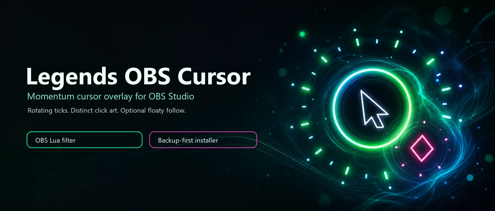
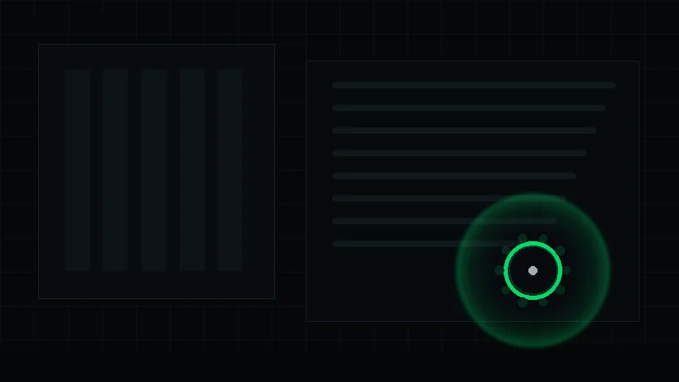
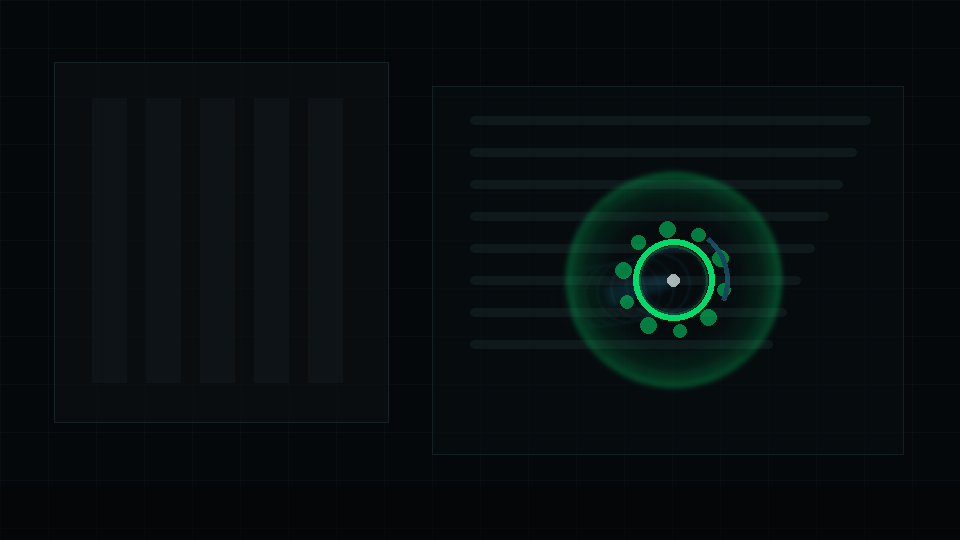
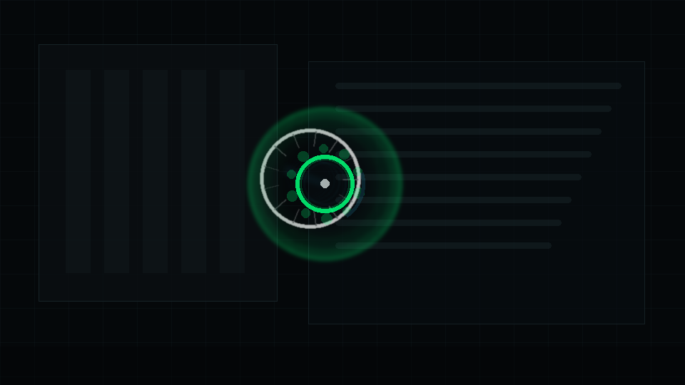
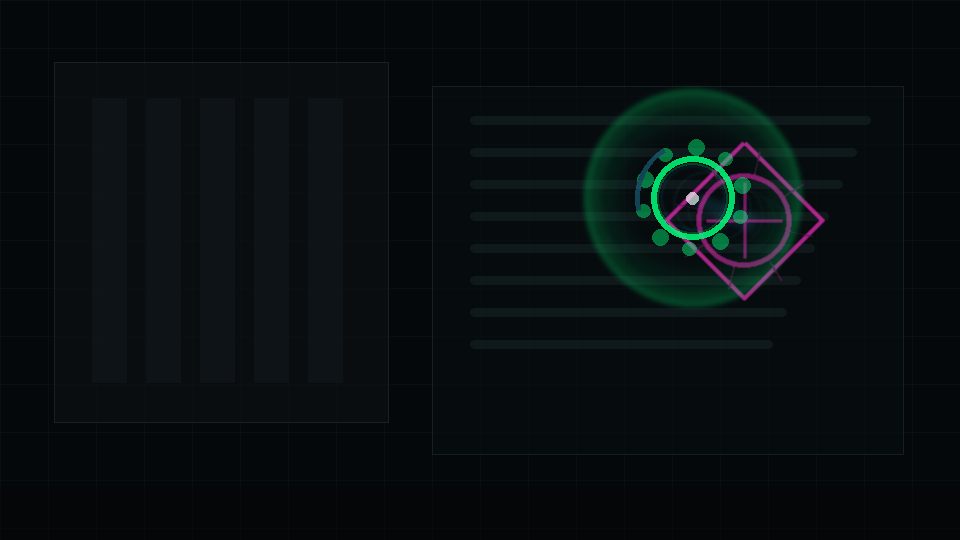

<p align="center">
  
</p>

# Legends OBS Cursor - OBS Cursor Overlay With Momentum Ticks

[](https://github.com/avalonreset/legends-obs-cursor/actions/workflows/validate.yml)
[](LICENSE)
[](https://obsproject.com/)
[](#requirements)

Legends OBS Cursor is an OBS cursor overlay that draws a stylized animated cursor for streams and recordings. It preserves the original Avalon Reset cursor language, including rotating momentum dots, distinct left-click and right-click art, and optional floaty follow smoothing for a more intentional on-screen motion feel.

## Table Of Contents

- [What It Does](#what-it-does)
- [Demo](#demo)
- [Requirements](#requirements)
- [Installation](#installation)
- [Configuration](#configuration)
- [Safe Installer Behavior](#safe-installer-behavior)
- [Project Layout](#project-layout)
- [Development](#development)
- [Credits](#credits)
- [License](#license)

## What It Does

- Adds an OBS video filter named `Legends Cursor Filter`.
- Polls the Windows cursor position through LuaJIT FFI and `user32.dll`.
- Draws the cursor halo, orbiting ticks, click effects, trails, and glow in an OBS shader.
- Keeps the original rotating momentum-tick look as the default.
- Adds optional `Enable floaty follow` and `Floaty lag ms` controls.
- Installs conservatively with PowerShell and backs up the OBS scene collection before editing.

## Demo

The demo below is a deterministic simulation of the Lua filter defaults. It models
floaty follow, speed-driven spin, rotating momentum ticks, comet trail samples,
left-click ripples, and the magenta right-click diamond burst.

<p align="center">
  
</p>

If your viewer does not animate WebP, use the [GIF fallback](assets/demo/legends-cursor-demo.gif).

<p align="center">
  
  
  
</p>

## Requirements

| Requirement | Notes |
| --- | --- |
| OBS Studio | Tested against the modern OBS 32.x Lua scripting path. |
| Windows | Cursor polling uses `user32.dll`, so this release targets Windows. |
| PowerShell | Used by the automatic installer. |
| Pointer overlay source | The installer looks for `pointer overlay` by default. |

## Installation

Close OBS before running the installer. OBS can overwrite scene collection JSON on exit, so the installer refuses to edit scenes while OBS is running unless you explicitly force it.

```powershell
powershell -ExecutionPolicy Bypass -File .\install_into_obs.ps1
```

To install and relaunch OBS from the standard Windows install path:

```powershell
powershell -ExecutionPolicy Bypass -File .\install_into_obs.ps1 -LaunchObs
```

The installer copies the Lua and compatibility shader files into the OBS scripts folder, registers the script in the active scene collection, and preserves or adds a `Legends Cursor Filter` on the target source.

## Manual Installation

1. Open OBS.
2. Go to `Tools > Scripts`.
3. Add `legends_cursor_filter.lua`.
4. Open filters for your cursor overlay source.
5. Add `Legends Cursor Filter`.

The shader is embedded in the Lua file. `legends_cursor_filter.effect` is kept beside it as a compatibility and review artifact.

## Configuration

Suggested starting settings:

| Setting | Value |
| --- | --- |
| Visual mode | `Momentum ticks` |
| Shape | `Circle` |
| Speed response | `Snappy` |
| Canvas width / height | Match your OBS canvas, such as `3840` / `2160` |
| Monitor origin X / Y | Usually `0` / `0` |
| Enable floaty follow | `On` |
| Floaty lag ms | `255` |

The important default is visual preservation: rotating dots and click effects stay available as first-class settings. New effects should be added as options, not silent replacements for the original art.

## Safe Installer Behavior

The PowerShell installer:

1. Resolves the OBS config root from `%APPDATA%\obs-studio`.
2. Copies script files into `scripts\legends-cursor-filter`.
3. Refuses to edit OBS scene JSON while OBS is running unless `-Force` is passed.
4. Creates a `.legends-cursor-backup-YYYYMMDD-HHMMSS` scene backup before editing.
5. Preserves the filter name `Legends Cursor Filter`.
6. Preserves the filter id `legends_cursor_filter`.

Use `-TargetSourceName` if your overlay source is not named `pointer overlay`.

```powershell
powershell -ExecutionPolicy Bypass -File .\install_into_obs.ps1 -TargetSourceName "cursor overlay"
```

## Project Layout

| Path | Purpose |
| --- | --- |
| `legends_cursor_filter.lua` | OBS Lua source and embedded shader. |
| `legends_cursor_filter.effect` | Extracted shader review artifact. |
| `install_into_obs.ps1` | Backup-first Windows installer. |
| `install_into_obs.cmd` | Double-click wrapper for the installer. |
| `install_and_launch_obs.cmd` | Double-click wrapper that installs and launches OBS. |
| `assets/` | README banner, animated demo, social preview, and keyframes. |
| `tools/render_assets.py` | Rebuilds generated README assets. |
| `tools/validate_package.ps1` | Local package validation gate. |

## Development

Run the validator before pushing changes:

```powershell
powershell -ExecutionPolicy Bypass -File .\tools\validate_package.ps1
```

Regenerate the README images after changing the visual language:

```powershell
python .\tools\render_assets.py
```

For OBS scene testing, use a duplicate scene collection first. Do not hot-edit a live recording scene unless you already made a backup and understand the risk.

Additional maintainer docs:

- [Art direction](docs/ART_DIRECTION.md)
- [Release checklist](docs/RELEASE_CHECKLIST.md)
- [Contributing guide](CONTRIBUTING.md)

## Credits

Legends OBS Cursor is an Avalon Reset project. See [CREDITS.md](CREDITS.md) for attribution and platform notes.

## License

Licensed under GPL-2.0-or-later. See [LICENSE](LICENSE). Third-party notices
and attribution context are preserved in [NOTICE](NOTICE) and [CREDITS.md](CREDITS.md).
